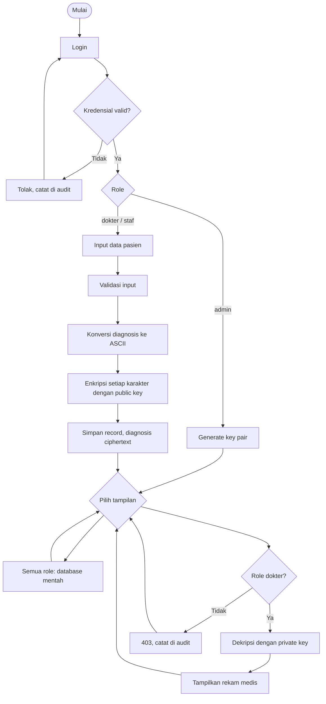

# EHR RSA Field Encryption

## Identitas Kelompok
| No | Nama | NIM | Peran |
|---:|---|---|---|
| 1 | Christiano Ronaldo  | 5027241025 | KeyGenerator + Matematika Dasar |
| 2 | Erlinda Annisa Zahra | 5027241108 | Encryptor + Penyimpanan Database |
| 3 | Oryza Qiara Ramadhani | 5027241084 | Decryptor + CLI + Integrasi |

## EHR RSA Field Encryption

Simulasi Electronic Health Record berbasis Python. Field `diagnosis` dienkripsi dengan RSA sebelum disimpan; `id`, `nama`, dan `umur` tetap plaintext. Perhitungan gcd, invers modular, dan modular exponentiation ditulis manual tanpa library kriptografi. Versi web dilengkapi login dengan tiga role (admin, dokter, staf) untuk membatasi siapa yang boleh membuat key, memasukkan data, dan mendekripsi.

> **Edukasi saja.** RSA per karakter ini tidak aman untuk data medis nyata. Jangan masukkan data pasien sungguhan.

## Ketentuan tugas dan kepatuhan

Ketentuan: program tanpa library atau framework jadi, dan dapat menunjukkan fungsi setiap tahapan RSA (pembangkitan kunci, enkripsi, dekripsi).

- Seluruh logika RSA (gcd, uji prima, Extended Euclidean, Square-and-Multiply, konversi ASCII, enkripsi, dekripsi) ditulis manual. Tidak ada `pow(..., mod)`, `hashlib`, `secrets`, `cryptography`, maupun library kriptografi lain.
- Autentikasi (hash password, token session, parsing cookie) juga ditulis manual.
- Pustaka standar Python hanya dipakai untuk hal non-kriptografi: `http.server` (server HTTP localhost), `argparse` (opsi CLI), `html.escape` (mencegah injeksi HTML), `urllib.parse.parse_qs` (membaca form), dan `random.SystemRandom` (sumber bilangan acak).
- Tidak ada framework web.

## Menjalankan

Perlu Python 3.10 atau lebih baru. Tidak ada dependensi eksternal.

CLI interaktif (tanpa login dan role):

```bash
python ehr_rsa.py
```

Web di localhost (dengan login dan role):

```bash
python ehr_rsa.py --web
```

Buka `http://127.0.0.1:8000`. Ganti port, jika diperlukan, dengan `python ehr_rsa.py --web --port 8080`. Data pasien, akun, session, dan audit log berada di memori dan hilang saat proses server berhenti. Key baru menggantikan key lama; untuk menjaga rekam medis tetap dapat dibaca, jangan membuat key baru setelah memasukkan data (program menolaknya selama database berisi data).

## Akun demo dan hak akses (web)

| Username | Password | Role |
|---|---|---|
| admin | admin123 | admin |
| dokter | dokter123 | dokter |
| staf | staf123 | staf |

| Aksi | admin | dokter | staf |
|---|---|---|---|
| Generate key pair | ✅ | ❌ | ❌ |
| Input pasien (enkripsi dengan public key) | ❌ | ✅ | ✅ |
| Lihat tabel mentah (ciphertext) | ✅ | ✅ | ✅ |
| Dekripsi diagnosis (private key) | ❌ | ✅ | ❌ |
| Lihat audit log | ✅ | ❌ | ❌ |

Prinsip rancangan:

- **Separation of duties.** Admin mengelola key tetapi tidak dapat mendekripsi, sehingga pengelola key bukan pembaca data medis.
- **Public key untuk enkripsi.** Staf dapat memasukkan data terenkripsi tanpa pernah memegang private key.
- **Tabel mentah terbuka untuk semua role** karena isinya ciphertext; yang dibatasi adalah aksi dekripsi dan pengelolaan key.
- **Pengecekan di server.** Izin diperiksa pada setiap rute POST, bukan hanya dengan menyembunyikan form. Permintaan manual (misalnya `curl`) tanpa izin ditolak dengan status 403.
- **Private key tidak tampil di web.** Log lengkap pembangkitan key (termasuk `d`) hanya dicetak di terminal server. Log dekripsi di web tidak memuat `d` maupun bit eksponen.
- **Audit log.** Login berhasil/gagal, pembuatan key, input pasien, dekripsi, dan akses ditolak dicatat, dan hanya terlihat oleh admin.

## Alur penggunaan

Web:

1. Login sebagai `admin`, klik Buat key pair.
2. Login sebagai `dokter` atau `staf`, masukkan ID, nama, umur, dan diagnosis ASCII.
3. Lihat tabel database untuk memeriksa ciphertext diagnosis.
4. Login sebagai `dokter`, masukkan ID pada bagian dekripsi untuk melihat diagnosis asli dan log proses.
5. Login sebagai `admin` untuk melihat audit log.

CLI:

1. Pilih menu 1 untuk membuat key pair.
2. Pilih menu 2 untuk memasukkan ID, nama, umur, dan diagnosis ASCII.
3. Pilih menu 3 untuk melihat tabel database mentah.
4. Pilih menu 4 untuk melihat rekam medis terdekripsi beserta log proses.

Diagnosis menerima karakter ASCII (kode 0–127), sesuai skema konversi ASCII pada tugas. Modulus yang dibangkitkan lebih besar dari 127. Database merupakan `list[dict]` di memori, bukan penyimpanan persisten.

## Struktur implementasi

Semua implementasi berada di `ehr_rsa.py` agar program utama tetap satu file dan dapat langsung dijalankan.

- `gcd`, `is_prime`, `generate_prime`: Euclidean Algorithm dan uji prima trial division.
- `mod_inverse`: Extended Euclidean Algorithm.
- `generate_keys`: membentuk `(e, n)`, `(d, n)`, dan detail p, q, n, phi, e, d.
- `key_generation_log`, `public_key_log`: log lengkap (terminal) dan log yang hanya memuat public key (web).
- `mod_pow`: Square-and-Multiply iteratif, tanpa `pow(..., mod)`.
- `text_to_ascii`, `encrypt_field`, `decrypt_field`: konversi dan RSA per karakter; log langkah diminta melalui argumen `log`, dan `reveal_key=False` menyembunyikan `d` serta bit eksponen dari log.
- `insert_patient`, `print_database`: validasi dan database `list[dict]`.
- `PERMISSIONS`, `USERS`, `SESSIONS`, `toy_hash`, `add_user`, `verify_user`, `new_session_token`, `parse_cookie`: autentikasi dan RBAC buatan sendiri.
- `run_cli`, `run_web`: antarmuka terminal dan HTTP sederhana memakai `http.server`.

## Batasan keamanan

- `toy_hash` adalah hash buatan sendiri (djb2 berulang), bukan hash kriptografis, dan rentan terhadap brute force. Dibuat manual karena tugas melarang library jadi; sistem nyata harus memakai bcrypt, Argon2, atau PBKDF2.
- Token session berasal dari `SystemRandom`, bukan modul yang dirancang khusus untuk token.
- Akun demo hardcoded, tidak ada HTTPS, tidak ada CSRF protection, dan tidak ada pembatasan percobaan login.
- Private key tetap berada di memori proses server. Siapa pun yang menguasai proses tersebut dapat mengambilnya. RBAC hanya access control di level aplikasi, bukan pengganti key management.
- ID, nama, dan umur plaintext sehingga metadata pasien tetap terbaca.
- CLI tidak memakai login dan role.
- Web hanya ditujukan untuk localhost. Jangan bind ke jaringan publik atau memakai data sensitif.

## Uji manual yang disarankan

| Kasus | Langkah | Hasil yang diharapkan |
|---|---|---|
| Key pair | Web: login admin, klik Buat key pair. CLI: menu 1 | `gcd(e, phi) = 1`; web hanya menampilkan public key, CLI menampilkan log lengkap |
| Enkripsi pasien | Login dokter, masukkan `1`, `Budi`, `25`, `Influenza` | Record tersimpan dan diagnosis berisi angka ciphertext, bukan `Influenza` |
| Database mentah | Lihat tabel | ID, nama, umur terbaca; diagnosis angka ciphertext |
| Dekripsi | Login dokter, buka record ID 1 | Diagnosis kembali menjadi `Influenza` |
| Tanpa login | Buka `/` tanpa login | Hanya form login |
| Login salah | Isi password salah | Error 401, tercatat di audit log |
| Role staf | Login staf | Tidak ada form key dan form dekripsi |
| Bypass role | `staf` kirim POST ke `/decrypt` lewat curl | 403, tercatat "AKSES DITOLAK" |
| Role admin | Login admin | Bisa buat key dan lihat audit log, tidak ada form dekripsi |
| Kebocoran key | Periksa halaman web dan log dekripsi | `d` dan bit eksponen tidak muncul |
| Validasi | Coba ID duplikat, umur 0, nama/diagnosis kosong, atau operasi tanpa key | Pesan error ditampilkan |
| Ciphertext invalid | Ubah panggilan `decrypt_field` dengan string nonangka atau nilai >= n | `ValueError` |

Contoh pemeriksaan round-trip dari Python:

```python
from ehr_rsa import generate_keys, encrypt_field, decrypt_field

public_key, private_key, _ = generate_keys()
assert decrypt_field(encrypt_field("Influenza", public_key), private_key) == "Influenza"
```

## Contoh alur terminal

Angka key dan ciphertext berbeda setiap kali dijalankan. Contoh alurnya:

```text
Pilih menu: 1
=== RSA KEY GENERATION ===
p = ...
q = ...
n = p × q = ...
phi(n) = (p-1)(q-1) = ...
Extended Euclidean Algorithm untuk e dan phi(n):
... = ... × ... + ...
d = e⁻¹ mod phi(n) = ...
Public Key = (..., ...)
Private Key = (..., ...)

Pilih menu: 2
ID Pasien: 1
Nama: Budi
Umur: 25
Diagnosis: Influenza
I -> 73
n -> 110
f -> 102
...
c = m^e mod n
Langkah 1: bit=..., hasil=..., basis=...
...
Tersimpan: {'id': 1, 'nama': 'Budi', 'umur': 25, 'diagnosis': '... ... ...'}

Pilih menu: 3
ID    Nama                    Umur    Diagnosis (ciphertext)
1     Budi                    25      ... ... ...

Pilih menu: 4
Ciphertext = ...
m = c^d mod n
...
Diagnosis : Influenza
```

## Flowchart



## Draf laporan ilmiah

### BAB I — Pendahuluan

#### 1.1 Latar Belakang

Digitalisasi layanan kesehatan mendorong penggunaan Electronic Health Records (EHR) untuk menyimpan dan mengelola informasi pasien. Rekam medis membantu tenaga kesehatan mengakses informasi secara terstruktur, tetapi memuat data pribadi dan klinis yang sensitif. Jika basis data tersalin atau diakses tanpa izin, penyimpanan plaintext membuat isi tersebut langsung terbaca.

Database Field Encryption melindungi nilai tertentu sebelum nilai itu disimpan. Dalam simulasi ini, diagnosis dipilih sebagai field sensitif dan dienkripsi, sedangkan ID, nama, dan umur tetap plaintext agar struktur contoh mudah dibaca. RSA digunakan sebagai sarana pembelajaran pasangan kunci publik dan privat, bukan sebagai rekomendasi desain produksi. Enkripsi saja belum cukup: siapa yang boleh membuat key, memasukkan data, dan mendekripsi juga perlu dibatasi, sehingga versi web menambahkan kontrol akses berbasis peran.

#### 1.2 Rumusan Masalah

1. Bagaimana membuat operasi dasar RSA tanpa library kriptografi?
2. Bagaimana mengenkripsi diagnosis sebelum penyimpanan?
3. Bagaimana mengembalikan diagnosis dengan private key?
4. Bagaimana memperlihatkan proses matematika RSA melalui CLI dan web lokal?
5. Bagaimana membatasi akses pembuatan key, input data, dan dekripsi berdasarkan peran pengguna?

#### 1.3 Tujuan Praktikum

Praktikum bertujuan memahami modular arithmetic, key generation, enkripsi dan dekripsi RSA, serta penerapan field encryption melalui simulasi EHR, termasuk pemisahan hak akses antara pihak yang mengelola key, pihak yang menginput data, dan pihak yang membaca data.

#### 1.4 Manfaat

Program memberi latihan implementasi algoritma kriptografi dasar, menunjukkan perbedaan field plaintext dan ciphertext, memperlihatkan manfaat kriptografi asimetris (pihak yang mengenkripsi tidak perlu mampu mendekripsi), dan memperkenalkan batasan perlindungan data saat tersimpan.

### BAB II — Dasar Teori RSA

#### 2.1 Kriptografi Asimetris

Kriptografi asimetris memakai pasangan kunci berbeda. Public key dapat dibagikan untuk mengenkripsi; private key dijaga untuk dekripsi. Kriptografi simetris memakai rahasia yang sama pada kedua proses, sehingga distribusi kuncinya perlu dilindungi.

#### 2.2 Bilangan Prima

RSA memilih prima berbeda `p` dan `q`. Pada program, kandidat diuji melalui pembagian trial division dalam rentang kecil yang cukup untuk demo ASCII.

#### 2.3 Greatest Common Divisor

`gcd(a, b)` mencari pembagi bersama terbesar. Euclidean Algorithm mengulang pasangan `(a, b)` menjadi `(b, a mod b)` sampai sisa nol. Nilai `e` dipilih relatif prima terhadap phi sehingga gcd-nya satu.

#### 2.4 Euler's Totient Function

Untuk `n = p × q` dengan p dan q prima berbeda, `phi(n) = (p-1)(q-1)`. Nilai ini dipakai untuk menyusun eksponen privat.

#### 2.5 Modular Arithmetic

Operasi `a mod n` mengambil sisa pembagian a oleh n. RSA menjaga hasil perhitungan dalam rentang modulus agar pangkat besar dapat dihitung tanpa membentuk bilangan raksasa.

#### 2.6 Extended Euclidean Algorithm

Algoritma ini menemukan koefisien x dan y sehingga `e×x + phi×y = gcd(e, phi)`. Karena gcd satu, x adalah invers modular dan `d = x mod phi`, sehingga `(e×d) mod phi = 1`.

#### 2.7 RSA Key Generation

Pilih `p != q`, hitung `n = p×q` dan `phi = (p-1)(q-1)`, pilih `1 < e < phi` dengan gcd satu, lalu hitung `d = e⁻¹ mod phi`. Public key adalah `(e,n)` dan private key `(d,n)`.

#### 2.8 RSA Encryption

Untuk satu nilai karakter `m`, ciphertext adalah `c = m^e mod n`, dengan e dan n berasal dari public key.

#### 2.9 RSA Decryption

Nilai karakter dipulihkan dengan `m = c^d mod n`, menggunakan private key. Program mengulang operasi untuk setiap angka ciphertext.

#### 2.10 Square-and-Multiply

Menghitung pangkat secara langsung dapat menghasilkan bilangan sangat besar. Square-and-Multiply memproses bit eksponen; hasil dikalikan saat bit bernilai satu dan basis dikuadratkan pada tiap iterasi, dengan reduksi modulo setelah operasi.

#### 2.11 Role-Based Access Control (RBAC)

RBAC memberi hak akses berdasarkan peran, bukan berdasarkan individu. Setiap peran memiliki himpunan izin, dan setiap permintaan diperiksa terhadap izin peran pengguna yang sedang login. Prinsip separation of duties memisahkan tugas yang berisiko jika dipegang satu pihak, misalnya pengelolaan key dan pembacaan data. Audit log mencatat aksi penting sehingga penggunaan hak akses dapat ditelusuri.

### BAB III — Analisis dan Perancangan Sistem

#### 3.1 Gambaran Sistem

Fase sistem: (1) login dan penentuan role; (2) pembentukan p, q, n, phi, e, dan d; (3) input diagnosis, konversi ASCII, lalu enkripsi dengan public key; (4) penyimpanan `{id, nama, umur, diagnosis}` dengan diagnosis ciphertext; dan (5) pembacaan diagnosis melalui dekripsi private key oleh role yang berwenang.

#### 3.2 Flowchart Sistem

Flowchart tersedia pada bagian Flowchart di atas dan menggambarkan proses login, pemeriksaan role, validasi, simpan ciphertext, lihat database, serta dekripsi.

#### 3.3 Skema Database

Database berupa `list[dict]` di memori. Setiap record memiliki `id: int`, `nama: str`, `umur: int`, dan `diagnosis: str` berisi ciphertext angka dipisahkan spasi. Data akun disimpan terpisah dalam `USERS` (salt, hash password, role), session dalam `SESSIONS`, dan audit log berupa list teks, seluruhnya di memori.

#### 3.4 Partial / Field Encryption

Hanya diagnosis dienkripsi. ID, nama, dan umur tetap dapat dibaca dan dicari, tetapi tetap mengungkap informasi administratif. Field encryption ini tidak menyembunyikan metadata. Pembatasan akses terhadap aksi dekripsi dan pengelolaan key dilakukan lewat kontrol akses pada level aplikasi (lihat 3.5).

#### 3.5 Kontrol Akses (RBAC) dan Separation of Duties

Versi web memakai tiga role. Admin mengelola key pair dan membaca audit log, tetapi tidak dapat mendekripsi data. Dokter dapat memasukkan data dan mendekripsi diagnosis. Staf hanya dapat memasukkan data, sehingga memakai public key untuk enkripsi tanpa pernah memegang private key. Seluruh role dapat melihat tabel mentah karena isinya ciphertext. Pengecekan izin dilakukan di sisi server pada setiap permintaan, dan private key tidak pernah ditampilkan pada antarmuka web.

| Aksi | admin | dokter | staf |
|---|---|---|---|
| Generate key pair | ✅ | ❌ | ❌ |
| Input pasien | ❌ | ✅ | ✅ |
| Lihat tabel mentah | ✅ | ✅ | ✅ |
| Dekripsi diagnosis | ❌ | ✅ | ❌ |
| Lihat audit log | ✅ | ❌ | ❌ |

### BAB IV — Implementasi dan Pengujian

#### 4.1 Modul Key Generation

`gcd` menjalankan Euclidean Algorithm; `is_prime` melakukan trial division; `generate_prime` memilih kandidat prima; `mod_inverse` menggunakan Extended Euclidean Algorithm; `generate_keys` membentuk pasangan key dan detail untuk logger. `key_generation_log` menampilkan seluruh langkah di terminal, sedangkan `public_key_log` hanya memuat public key untuk antarmuka web.

#### 4.2 Modul Enkripsi dan Database

`mod_pow` mengimplementasikan Square-and-Multiply. `text_to_ascii` memetakan karakter ASCII ke integer. `encrypt_field` menerapkan RSA untuk setiap nilai; `insert_patient` memvalidasi serta menyimpan ciphertext; `print_database` menampilkan tabel mentah.

Contoh konversi: `Flu` menjadi `[70, 108, 117]`, kemudian masing-masing nilai dipangkatkan modulo n. Nilai ciphertext aktual berubah mengikuti key.

#### 4.3 Modul Dekripsi dan Antarmuka

`decrypt_field` memvalidasi angka ciphertext, menghitung `c^d mod n`, lalu mengubah hasil ASCII ke karakter. Pada web, dekripsi dipanggil dengan `reveal_key=False` sehingga log tidak memuat `d` maupun bit eksponen. CLI berjalan secara interaktif dan menampilkan langkah lengkap; web memakai `http.server` dan form HTML sederhana di localhost.

#### 4.4 Modul Autentikasi dan RBAC

`add_user` menyimpan salt acak dan hash password; `verify_user` membandingkan hash dan mengembalikan role; `new_session_token` membuat token session acak yang dikirim lewat cookie `HttpOnly` dan `SameSite=Strict`; `PERMISSIONS` memetakan role ke himpunan izin; `require` menolak aksi tanpa izin dengan status 403. Hash password memakai `toy_hash` buatan sendiri karena tugas melarang library jadi; hash ini bukan hash kriptografis dan hanya untuk demo. Aksi penting dicatat pada audit log.

#### 4.5 Pengujian Sistem

Kasus uji yang disarankan ada di tabel Uji Manual. Kriteria utamanya adalah `gcd(e,phi)=1`, `(e×d) mod phi=1`, record tidak menyimpan plaintext diagnosis, round-trip memenuhi `decrypt(encrypt(teks)) == teks`, serta setiap role hanya dapat melakukan aksi yang diizinkan, termasuk ketika permintaan dikirim manual tanpa melalui form. Uji juga input invalid, operasi sebelum key dibuat, dan memastikan private key tidak muncul pada halaman web.

#### 4.6 Screenshot Output

Ambil screenshot CLI untuk: menu utama, key generation, langkah Extended Euclidean, input pasien, ASCII, enkripsi, database mentah, dekripsi, dan rekam medis. Ambil screenshot web untuk: form login, tampilan tiap role (admin, dokter, staf), tabel database mentah, hasil dekripsi oleh dokter, pesan 403 saat akses ditolak, dan audit log admin. Output key dan ciphertext acak sehingga hasil gambar dapat berbeda. Screenshot belum disertakan dalam draf ini.

### BAB V — Penutup

#### 5.1 Kesimpulan

Simulasi menerapkan operasi RSA manual, membuat pasangan key, mengenkripsi diagnosis sebelum penyimpanan, dan mendekripsinya kembali. Tabel mentah menunjukkan diagnosis sebagai ciphertext sementara field administratif tetap plaintext. Kontrol akses berbasis peran memisahkan pengelola key (admin), pihak yang menginput data (dokter, staf), dan pihak yang berwenang mendekripsi (dokter), sehingga pihak yang mengenkripsi tidak perlu memegang private key.

#### 5.2 Saran Pengembangan

Untuk sistem nyata, gunakan algoritma dan pustaka kriptografi yang telah ditinjau, key berukuran standar, OAEP, hashing password standar (bcrypt, Argon2, atau PBKDF2), TLS, CSRF protection, pembatasan percobaan login, penyimpanan persisten, audit log persisten, backup aman, dan key management terpisah (HSM atau KMS). Umumnya data dienkripsi dengan AES lalu key AES dilindungi RSA (hybrid encryption). Demo ini memakai RSA per karakter tanpa padding, key kecil, hash password buatan sendiri, akun hardcoded, dan penyimpanan key hanya di memori server; sifat-sifat tersebut membuatnya tidak aman untuk produksi. RBAC pada demo hanya membatasi akses di level aplikasi, sehingga pihak yang menguasai proses server tetap dapat mengambil private key.