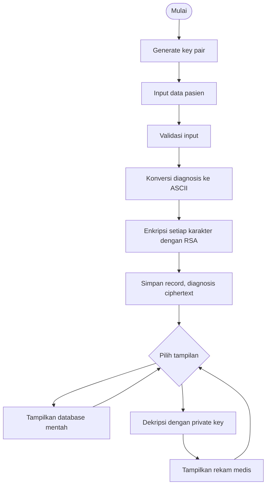

# EHR RSA Field Encryption

Simulasi Electronic Health Record berbasis Python. Field `diagnosis` dienkripsi dengan RSA sebelum disimpan; `id`, `nama`, dan `umur` tetap plaintext. Perhitungan gcd, invers modular, dan modular exponentiation ditulis manual tanpa library kriptografi.

> **Edukasi saja.** RSA per karakter ini tidak aman untuk data medis nyata. Jangan masukkan data pasien sungguhan.

## Menjalankan

Perlu Python 3.10 atau lebih baru. Tidak ada dependensi eksternal.

CLI interaktif:

```bash
python ehr_rsa.py
```

Web sederhana di localhost:

```bash
python ehr_rsa.py --web
```

Buka `http://127.0.0.1:8000`. Ganti port, jika diperlukan, dengan `python ehr_rsa.py --web --port 8080`. Data berada di memori dan hilang saat proses server berhenti. Key baru menggantikan key lama; untuk menjaga rekam medis tetap dapat dibaca, jangan membuat key baru setelah memasukkan data.

## Alur penggunaan

1. Buat RSA key pair.
2. Masukkan ID, nama, umur, dan diagnosis ASCII.
3. Lihat tabel database untuk memeriksa ciphertext diagnosis.
4. Masukkan ID pada bagian dekripsi untuk melihat diagnosis asli dan log proses.

Diagnosis menerima karakter ASCII (kode 0–127), sesuai skema konversi ASCII pada tugas. Modulus yang dibangkitkan lebih besar dari 127. Database merupakan `list[dict]` di memori, bukan penyimpanan persisten.

## Struktur implementasi

Semua implementasi berada di `ehr_rsa.py` agar program utama tetap satu file dan dapat langsung dijalankan.

- `gcd`, `is_prime`, `generate_prime`: Euclidean Algorithm dan uji prima trial division.
- `mod_inverse`: Extended Euclidean Algorithm.
- `generate_keys`: membentuk `(e, n)`, `(d, n)`, dan detail p, q, n, phi, e, d.
- `mod_pow`: Square-and-Multiply iteratif, tanpa `pow(..., mod)`.
- `text_to_ascii`, `encrypt_field`, `decrypt_field`: konversi dan RSA per karakter; log langkah dapat diminta melalui argumen `log`.
- `insert_patient`, `print_database`: validasi dan database `list[dict]`.
- `run_cli`, `run_web`: antarmuka terminal dan HTTP sederhana memakai pustaka standar `http.server`.

Web hanya ditujukan untuk localhost. Server ini tidak menyediakan login, CSRF protection, database persisten, ataupun manajemen key. Jangan bind ke jaringan publik atau menggunakannya untuk data sensitif.

## Uji manual yang disarankan

| Kasus | Langkah | Hasil yang diharapkan |
|---|---|---|
| Key pair | Pilih menu 1 / tombol Buat key pair | `gcd(e, phi) = 1`, public dan private key tampil |
| Enkripsi pasien | Masukkan `1`, `Budi`, `25`, `Influenza` | Record tersimpan dan diagnosis berisi angka ciphertext, bukan `Influenza` |
| Database mentah | Lihat tabel | ID, nama, umur terbaca; diagnosis angka ciphertext |
| Dekripsi | Buka record ID 1 | Diagnosis kembali menjadi `Influenza` |
| Validasi | Coba ID duplikat, umur 0, nama/diagnosis kosong, atau operasi tanpa key | Pesan error ditampilkan |
| Ciphertext invalid | Ubah panggilan `decrypt_field` dengan string nonangka atau nilai >= n | `ValueError` |

Contoh pemeriksaan round-trip dari Python:

```python
from ehr_rsa import generate_keys, encrypt_field, decrypt_field

public_key, private_key, _ = generate_keys()
assert decrypt_field(encrypt_field("Influenza", public_key), private_key) == "Influenza"
```

## Contoh alur terminal

Angka key dan ciphertext berbeda setiap kali dijalankan. Contoh alurnya:

```text
Pilih menu: 1
=== RSA KEY GENERATION ===
p = ...
q = ...
n = p × q = ...
phi(n) = (p-1)(q-1) = ...
Extended Euclidean Algorithm untuk e dan phi(n):
... = ... × ... + ...
d = e⁻¹ mod phi(n) = ...
Public Key = (..., ...)
Private Key = (..., ...)

Pilih menu: 2
ID Pasien: 1
Nama: Budi
Umur: 25
Diagnosis: Influenza
I -> 73
n -> 110
f -> 102
...
c = m^e mod n
Langkah 1: bit=..., hasil=..., basis=...
...
Tersimpan: {'id': 1, 'nama': 'Budi', 'umur': 25, 'diagnosis': '... ... ...'}

Pilih menu: 3
ID    Nama                    Umur    Diagnosis (ciphertext)
1     Budi                    25      ... ... ...

Pilih menu: 4
Ciphertext = ...
m = c^d mod n
...
Diagnosis : Influenza
```

## Flowchart



## Draf laporan ilmiah

### BAB I — Pendahuluan

#### 1.1 Latar Belakang

Digitalisasi layanan kesehatan mendorong penggunaan Electronic Health Records (EHR) untuk menyimpan dan mengelola informasi pasien. Rekam medis membantu tenaga kesehatan mengakses informasi secara terstruktur, tetapi memuat data pribadi dan klinis yang sensitif. Jika basis data tersalin atau diakses tanpa izin, penyimpanan plaintext membuat isi tersebut langsung terbaca.

Database Field Encryption melindungi nilai tertentu sebelum nilai itu disimpan. Dalam simulasi ini, diagnosis dipilih sebagai field sensitif dan dienkripsi, sedangkan ID, nama, dan umur tetap plaintext agar struktur contoh mudah dibaca. RSA digunakan sebagai sarana pembelajaran pasangan kunci publik dan privat, bukan sebagai rekomendasi desain produksi.

#### 1.2 Rumusan Masalah

1. Bagaimana membuat operasi dasar RSA tanpa library kriptografi?
2. Bagaimana mengenkripsi diagnosis sebelum penyimpanan?
3. Bagaimana mengembalikan diagnosis dengan private key?
4. Bagaimana memperlihatkan proses matematika RSA melalui CLI dan web lokal?

#### 1.3 Tujuan Praktikum

Praktikum bertujuan memahami modular arithmetic, key generation, enkripsi dan dekripsi RSA, serta penerapan field encryption melalui simulasi EHR.

#### 1.4 Manfaat

Program memberi latihan implementasi algoritma kriptografi dasar, menunjukkan perbedaan field plaintext dan ciphertext, dan memperkenalkan batasan perlindungan data saat tersimpan.

### BAB II — Dasar Teori RSA

#### 2.1 Kriptografi Asimetris

Kriptografi asimetris memakai pasangan kunci berbeda. Public key dapat dibagikan untuk mengenkripsi; private key dijaga untuk dekripsi. Kriptografi simetris memakai rahasia yang sama pada kedua proses, sehingga distribusi kuncinya perlu dilindungi.

#### 2.2 Bilangan Prima

RSA memilih prima berbeda `p` dan `q`. Pada program, kandidat diuji melalui pembagian trial division dalam rentang kecil yang cukup untuk demo ASCII.

#### 2.3 Greatest Common Divisor

`gcd(a, b)` mencari pembagi bersama terbesar. Euclidean Algorithm mengulang pasangan `(a, b)` menjadi `(b, a mod b)` sampai sisa nol. Nilai `e` dipilih relatif prima terhadap phi sehingga gcd-nya satu.

#### 2.4 Euler's Totient Function

Untuk `n = p × q` dengan p dan q prima berbeda, `phi(n) = (p-1)(q-1)`. Nilai ini dipakai untuk menyusun eksponen privat.

#### 2.5 Modular Arithmetic

Operasi `a mod n` mengambil sisa pembagian a oleh n. RSA menjaga hasil perhitungan dalam rentang modulus agar pangkat besar dapat dihitung tanpa membentuk bilangan raksasa.

#### 2.6 Extended Euclidean Algorithm

Algoritma ini menemukan koefisien x dan y sehingga `e×x + phi×y = gcd(e, phi)`. Karena gcd satu, x adalah invers modular dan `d = x mod phi`, sehingga `(e×d) mod phi = 1`.

#### 2.7 RSA Key Generation

Pilih `p != q`, hitung `n = p×q` dan `phi = (p-1)(q-1)`, pilih `1 < e < phi` dengan gcd satu, lalu hitung `d = e⁻¹ mod phi`. Public key adalah `(e,n)` dan private key `(d,n)`.

#### 2.8 RSA Encryption

Untuk satu nilai karakter `m`, ciphertext adalah `c = m^e mod n`, dengan e dan n berasal dari public key.

#### 2.9 RSA Decryption

Nilai karakter dipulihkan dengan `m = c^d mod n`, menggunakan private key. Program mengulang operasi untuk setiap angka ciphertext.

#### 2.10 Square-and-Multiply

Menghitung pangkat secara langsung dapat menghasilkan bilangan sangat besar. Square-and-Multiply memproses bit eksponen; hasil dikalikan saat bit bernilai satu dan basis dikuadratkan pada tiap iterasi, dengan reduksi modulo setelah operasi.

### BAB III — Analisis dan Perancangan Sistem

#### 3.1 Gambaran Sistem

Fase sistem: (1) pembentukan p, q, n, phi, e, dan d; (2) input diagnosis, konversi ASCII, lalu enkripsi; (3) penyimpanan `{id, nama, umur, diagnosis}` dengan diagnosis ciphertext; dan (4) pembacaan diagnosis melalui dekripsi private key.

#### 3.2 Flowchart Sistem

Flowchart tersedia pada bagian Flowchart di atas dan menggambarkan proses validasi, simpan ciphertext, lihat database, serta dekripsi.

#### 3.3 Skema Database

Database berupa `list[dict]` di memori. Setiap record memiliki `id: int`, `nama: str`, `umur: int`, dan `diagnosis: str` berisi ciphertext angka dipisahkan spasi.

#### 3.4 Partial / Field Encryption

Hanya diagnosis dienkripsi. ID, nama, dan umur tetap dapat dibaca dan dicari, tetapi tetap mengungkap informasi administratif. Field encryption ini tidak menyembunyikan metadata atau melindungi aplikasi dari akses tanpa otorisasi.

### BAB IV — Implementasi dan Pengujian

#### 4.1 Modul Key Generation

`gcd` menjalankan Euclidean Algorithm; `is_prime` melakukan trial division; `generate_prime` memilih kandidat prima; `mod_inverse` menggunakan Extended Euclidean Algorithm; `generate_keys` membentuk pasangan key dan detail untuk logger.

#### 4.2 Modul Enkripsi dan Database

`mod_pow` mengimplementasikan Square-and-Multiply. `text_to_ascii` memetakan karakter ASCII ke integer. `encrypt_field` menerapkan RSA untuk setiap nilai; `insert_patient` memvalidasi serta menyimpan ciphertext; `print_database` menampilkan tabel mentah.

Contoh konversi: `Flu` menjadi `[70, 108, 117]`, kemudian masing-masing nilai dipangkatkan modulo n. Nilai ciphertext aktual berubah mengikuti key.

#### 4.3 Modul Dekripsi dan Antarmuka

`decrypt_field` memvalidasi angka ciphertext, menghitung `c^d mod n`, lalu mengubah hasil ASCII ke karakter. CLI berjalan secara interaktif; web memakai `http.server` dan form HTML sederhana di localhost.

#### 4.4 Pengujian Sistem

Kasus uji yang disarankan ada di tabel Uji Manual. Kriteria utamanya adalah `gcd(e,phi)=1`, `(e×d) mod phi=1`, record tidak menyimpan plaintext diagnosis, dan round-trip memenuhi `decrypt(encrypt(teks)) == teks`. Uji juga input invalid dan operasi sebelum key dibuat.

#### 4.5 Screenshot Output Terminal

Ambil screenshot setelah menjalankan CLI untuk: menu utama, key generation, langkah Extended Euclidean, input pasien, ASCII, enkripsi, database mentah, dekripsi, dan rekam medis. Output key dan ciphertext acak sehingga hasil gambar dapat berbeda. Screenshot belum disertakan dalam draf ini.

### BAB V — Penutup

#### 5.1 Kesimpulan

Simulasi menerapkan operasi RSA manual, membuat pasangan key, mengenkripsi diagnosis sebelum penyimpanan, dan mendekripsinya kembali. Tabel mentah menunjukkan diagnosis sebagai ciphertext sementara field administratif tetap plaintext.

#### 5.2 Saran Pengembangan

Untuk sistem nyata, gunakan algoritma dan pustaka kriptografi yang telah ditinjau, key berukuran standar, OAEP, autentikasi, kontrol akses berbasis peran, audit, TLS, penyimpanan persisten, backup aman, dan key management. Umumnya data dienkripsi dengan AES lalu key AES dilindungi RSA (hybrid encryption). Demo ini memakai RSA per karakter tanpa padding, key kecil, dan penyimpanan key hanya di memori; sifat-sifat tersebut membuatnya tidak aman untuk produksi.
